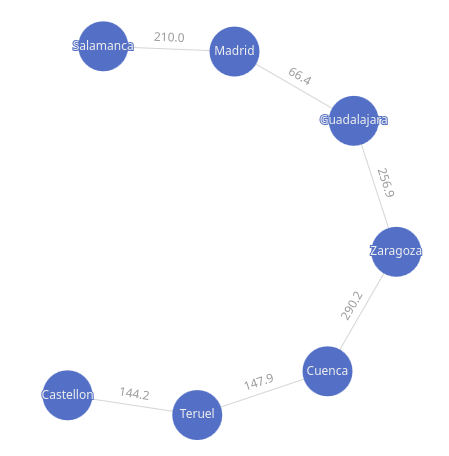

## Distances

Sometimes comes handy to know what is the shortest path from one node to another. It could be anything: How many people do I have to meet to meet a specific person ? How many cities do I have to visit before getting to a specific location ? ...etc

Here's a very naive example with cities. The following graph contains cities and the edges represent how many kilometers there are between them.



We'd like to use the graph as a route planner to get from point A to B. First we need to create our graph:

```groovy title="cities distances graph"
--8<-- "src/test/groovy/underdog/guide/graphs/DistancesSpec.groovy:shortest_path_graph"
```

See how the weight of the edges represent the km between then. Then I'd like to know how many kilometers I'm going to drive if I'd like to go from Teruel to Madrid:

```groovy title="kms"
--8<-- "src/test/groovy/underdog/guide/graphs/DistancesSpec.groovy:shortest_path_edges"
```

I've taken the edges and I've added up all weights to get the whole trip in kms:

```shell title="output"
761.4
```

To get the city names I'm asking for the shortest path getting the vertices this time:

```groovy title="cities visited"
--8<-- "src/test/groovy/underdog/guide/graphs/DistancesSpec.groovy:shortest_path_vertices"
```

```shell title="output"
["Teruel", "Cuenca", "Zaragoza", "Guadalajara", "Madrid"]
```

If you are not sure whether you are interested in vertices or edges, or maybe you are interested in both, just use `shortestPath`:

```groovy title="shortestPath"
--8<-- "src/test/groovy/underdog/guide/graphs/DistancesSpec.groovy:shortest_path"
```

And access the resulting object:

```groovy title="shortestPath attributes"
--8<-- "src/test/groovy/underdog/guide/graphs/DistancesSpec.groovy:shortest_path_attributes"
```