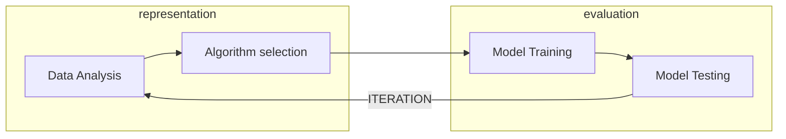
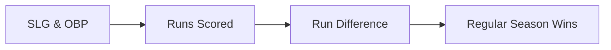

## Tutorial

### Prerequisites

#### Dependencies

The modules required to follow this tutorial are the `ml` and `plots` modules:

=== "Gradle"
    ```groovy
    // machine learning
    implementation 'com.github.grooviter:underdog-ml:VERSION'

    // plots
    implementation 'com.github.grooviter:underdog-plots:VERSION'
    ```
=== "Maven"
    ```xml
    <!-- machine learning -->
    <dependency>
        <groupId>com.github.grooviter</groupId>
        <artifactId>underdog-ml</artifactId>
        <version>VERSION</version>
    </dependency>
    <!-- plots -->
    <dependency>
        <groupId>com.github.grooviter</groupId>
        <artifactId>underdog-plots</artifactId>
        <version>VERSION</version>
    </dependency>
    ```
=== "Grapes"
    ```groovy
    @Grapes([
        // machine learning
        @Grab('com.github.grooviter:underdog-ml:VERSION'),
        // plots
        @Grab('com.github.grooviter:underdog-plots:VERSION')
    ])
    ```

#### Data

You can find the data used in this tutorial [here](https://github.com/grooviter/underdog/blob/main/docs/guide/src/test/resources/data/baseball.csv)

### Introduction

!!! info

    The current tutorial follows the [Tablesaw Moneyball tutorial](https://grooviter.github.io/tablesaw/#_moneyball) but using Underdog's dataframe and ml modules.

In baseball, you make the playoffs by winning more games than your rivals, but you can’t control the number of games your rivals win. How should you proceed? The A’s needed to find controllable variables that affected their likelihood of making the playoffs.

Specifically, they wanted to know how to spend their salary dollars to produce the most wins. Statistics like "Batting Average" are available for individual players so if you knew Batting Average had the greatest impact, you can trade for players with high batting averages, and thus improve your odds of success.

To connect player stats to making the playoffs, they systematically decomposed their high-level goal. They started by asking how many wins they’d need to make the playoffs. They decided that 95 wins would give them a strong chance. Here’s how we might check that assumption using Underdog.

The tutorial also tries to follow the iterative process:



### Analyzing data

To connect player stats to making the playoffs, they systematically decomposed their high-level goal. They started by asking how many wins they’d need to make the playoffs. They decided that 95 wins would give them a strong chance. Here’s how we might check that assumption using Underdog. First lets load the data:

```groovy title="loading data"
--8<-- "src/test/groovy/underdog/guide/ml/TutorialSpec.groovy:import"

--8<-- "src/test/groovy/underdog/guide/ml/TutorialSpec.groovy:loading_data"
```

Lets take only data before 2002:

```groovy title="filtering"
--8<-- "src/test/groovy/underdog/guide/ml/TutorialSpec.groovy:only_before_2002"
```

We can check the assumption visually by plotting wins per year in a way that separates the teams who make the playoffs from those who don’t. This code produces the chart below:

```groovy title="playoffs"
--8<-- "src/test/groovy/underdog/guide/ml/TutorialSpec.groovy:show_playoffs"
```

The Series `data['playoffs']` represents whether the team made it to the playoffs (1) or it didn't (0).

<figure markdown="span">
{ width="60%" }
{ width="60%" }
</figure>

### Preparing data

Unfortunately, you can’t directly control the number of games you win. We need to go deeper. At the next level, we hypothesize that the number of wins can be predicted by the number of Runs Scored during the season, combined with the number of Runs Allowed.

To check this assumption we compute Run Difference (RD) as Runs Scored (RS) - Runs Allowed (RA)

```groovy title="difference"
--8<-- "src/test/groovy/underdog/guide/ml/TutorialSpec.groovy:show_difference"
```

Now lets see if Run Difference is correlated with Wins. We use a scatter plot again:

```groovy title="correlation"
--8<-- "src/test/groovy/underdog/guide/ml/TutorialSpec.groovy:show_correlation"
```

<figure markdown="span">
{ width="60%" }
{ width="60%" }
</figure>

### Model training

Let’s create our first predictive model using linear regression, with runDifference as the sole explanatory variable. 
Here we use Ordinary Least Squares (OLS) regression model.

!!! tip

    To know more about Ordinary Least Squares you can check out its definition in [Wikipedia](https://en.wikipedia.org/wiki/Ordinary_least_squares)

```groovy title="Ordinary least square (OLS)"
--8<-- "src/test/groovy/underdog/guide/ml/TutorialSpec.groovy:ols"
```

If we print our “winsModel”, it produces the output below:

```shell title="output"
Residuals:
Min          1Q      Median          3Q         Max
-14.4535     -2.5195      0.2255      2.9513     11.5651

Coefficients:
Estimate Std. Error    t value   Pr(>|t|)
Intercept          80.9257     0.1838   440.3014     0.0000 ***
X0                  0.1038     0.0019    54.6362     0.0000 ***
---------------------------------------------------------------------
Significance codes:  0 '***' 0.001 '**' 0.01 '*' 0.05 '.' 0.1 ' ' 1

Residual standard error: 3.9032 on 449 degrees of freedom
Multiple R-squared: 0.8693,    Adjusted R-squared: 0.8690
F-statistic: 2985.1152 on 2 and 449 DF,  p-value: 1.757e-200
```

If you’re new to regression, here are some take-aways from the output:

- The R-squared of .88 can be interpreted to mean that **roughly 88% of the variance in Wins can be explained by the Run Difference variable**. The rest is determined by some combination of other variables and pure chance.
- **The estimate for the Intercept is the average wins independent of Run Difference**. In baseball, we have a 162 game season so we expect this value to be about 81, as it is.
- The estimate for the RD variable of .1, suggests that **an increase of 10 in Run Difference, should produce about 1 additional win over the course of the season**.

Of course, this model is not simply descriptive. We can use it to make predictions. In the code below, we predict how many games we will win if we score 135 more runs than our opponents.  To do this, we pass an array of doubles, one for each explanatory variable in our model, to the predict() method. In this case, there’s just one variable: run difference.

```groovy title="using prediction"
--8<-- "src/test/groovy/underdog/guide/ml/TutorialSpec.groovy:ols_sample_prediction"
```

```shell title="output"
94.93591869149651
```

We’d expect almost 95 wins when we outscore opponents by 135 runs.

### Scoring with test data

If we want to check how the model is performing overall we can pick the testing datasets we kept aside from the model training and use them to get a measure on how well the model is predicting a new case.

In this example we are using the [R2 square metric](https://en.wikipedia.org/wiki/Coefficient_of_determination). 
In regression, the R2 score is a statistical measure of **how well the regression predictions approximate the real data points**.

We're passing to the model the testing features (xTest) and comparing the model predictions with the test labels we have (yTest):

```groovy title="r2score"
--8<-- "src/test/groovy/underdog/guide/ml/TutorialSpec.groovy:score"
```

Getting a result of:

```shell title="output"
0.8895307770897616
```

### Modeling Runs Scored

It’s time to go deeper again and see how we can model Runs Scored and Runs Allowed. The approach the A’s took was to model Runs Scored using team On-base percent (OBP) and team Slugging Average (SLG). In Underdog, we write:

```groovy
--8<-- "src/test/groovy/underdog/guide/ml/TutorialSpec.groovy:runs_scored_model"
```

Once again the first parameter takes a Underdog column containing the values we want to predict (Runs scored). The next two parameters take the explanatory variables OBP and SLG.

```shell title="output"
Residuals:
Min          1Q      Median          3Q         Max
-67.7289    -18.0586     -1.5988     16.8863     68.9436

Coefficients:
Estimate Std. Error    t value   Pr(>|t|)
Intercept        -846.1069    29.6301   -28.5556     0.0000 ***
X0               2937.5751   141.7312    20.7264     0.0000 ***
X1               1524.8355    65.4379    23.3020     0.0000 ***
---------------------------------------------------------------------
Significance codes:  0 '***' 0.001 '**' 0.01 '*' 0.05 '.' 0.1 ' ' 1

Residual standard error: 25.4627 on 448 degrees of freedom
Multiple R-squared: 0.9204,    Adjusted R-squared: 0.9201
F-statistic: 2590.2693 on 3 and 448 DF,  p-value: 6.276e-247
```

Again we have a model with excellent explanatory power with an R-squared of 92. Now we’ll check the model visually to see if it violates any assumptions. Our residuals should be normally distributed. We can use a histogram to verify:

```groovy title="histogram"
--8<-- "src/test/groovy/underdog/guide/ml/TutorialSpec.groovy:runs_scored_histogram"
```

<figure markdown="span">
{ width="60%" }
{ width="60%" }
</figure>

It looks great.  It’s also important to plot the predicted (or “fitted”) values against the residuals. We want to see if the model fits some values better than others, which will influence whether we can trust its predictions or not. Ideally, we want to see a cloud of random dots around zero on the y axis.

Our Scatter class can create this plot directly from the model:

```groovy title="fitted vs residuals"
--8<-- "src/test/groovy/underdog/guide/ml/TutorialSpec.groovy:fitted_vs_residuals"
```

<figure markdown="span">
{ width="60%" }
{ width="60%" }
</figure>

Again, the plot looks good.

Let’s review.  We’ve created a model of baseball that predicts entry into the playoffs based on batting stats, with the influence of the variables as:



### Modeling Runs Allowed

Of course, we haven’t modeled the Runs Allowed side of Run Difference. We could use pitching and field stats to do this, but the A’s cleverly used the same two variables (SLG and OBP), but now looked at how their opponent’s performed against the A’s. We could do the same as these data are encoded in the dataset as OOBP and OSLG.

```groovy title="SLG & OBP"
--8<-- "src/test/groovy/underdog/guide/ml/TutorialSpec.groovy:modeling_runs_allowed_model"
```

```groovy title="print"
println(runsAllowed)
```

```shell title="output"
Residuals:
Min          1Q      Median          3Q         Max
-82.1479     -8.9954      0.7291     15.7773     46.4004

Coefficients:
Estimate Std. Error    t value   Pr(>|t|)
Intercept        -822.7172    97.7824    -8.4138     0.0000 ***
X0               2844.9158   524.5965     5.4231     0.0000 ***
X1               1532.0857   286.8341     5.3414     0.0000 ***
---------------------------------------------------------------------
Significance codes:  0 '***' 0.001 '**' 0.01 '*' 0.05 '.' 0.1 ' ' 1

Residual standard error: 27.7020 on 42 degrees of freedom
Multiple R-squared: 0.8985,    Adjusted R-squared: 0.8936
F-statistic: 185.8286 on 3 and 42 DF,  p-value: 1.377e-21
```

This model also looks good, but you’d want to look at the plots again, and do other checking as well. Checking the predictive variables for collinearity is always good.

Finally, we can tie this all together and see how well wins is predicted when we consider both offensive and defensive stats.

```groovy title="regression"
--8<-- "src/test/groovy/underdog/guide/ml/TutorialSpec.groovy:offensive_plus_defensive_model"
```

### The A's in 2001

For fun, I decided to see what the model predicts for the 2001 A’s. First, I got the independent variables for the A’s in that year.

```groovy title="A's in 2001"
--8<-- "src/test/groovy/underdog/guide/ml/TutorialSpec.groovy:as_in_2001"
```

```shell title="output"
                 baseball.csv
Year  |  OOBP   |   OBP   |  OSLG  |   SLG   |
-----------------------------------------------
2001  |  0.308  |  0.345  |  0.38  |  0.439  |
```

Now we get the prediction:

```groovy title="A's in 2001"
--8<-- "src/test/groovy/underdog/guide/ml/TutorialSpec.groovy:as_in_2001_prediction"
```

```shell title="output"
102.22837899017894
```

The model predicted that the 2001 A’s would win 102 games given their slugging and On-Base stats. They won 103.