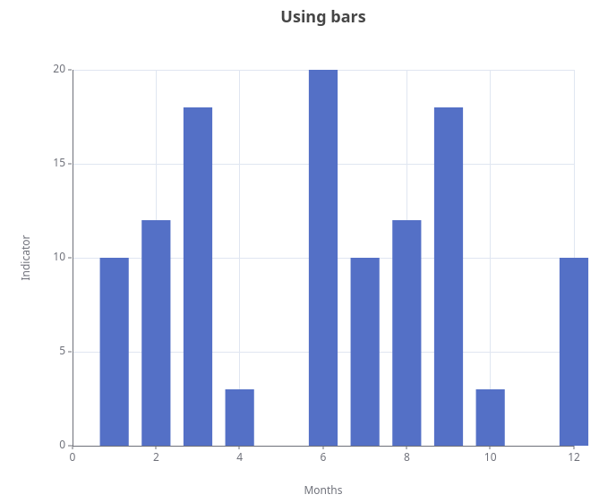
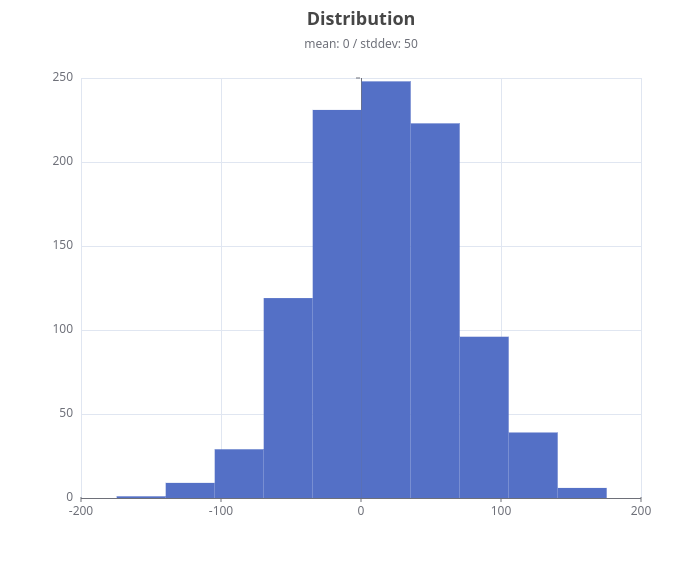

## Bar

### Simple

```groovy title="simple bar"
--8<-- "src/test/groovy/underdog/guide/plots/BarSpec.groovy:simple"
```

{ width="60%" }

### Histogram

```groovy title="simple histogram"
--8<-- "src/test/groovy/underdog/guide/plots/BarSpec.groovy:histogram_simple"
```

{ width="60%" }