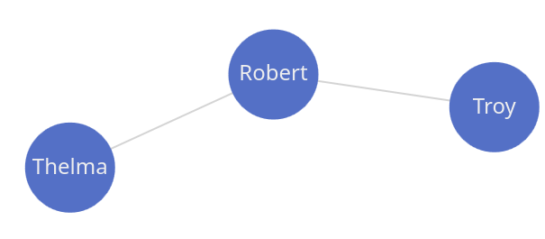
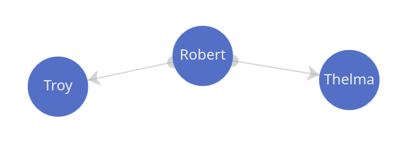
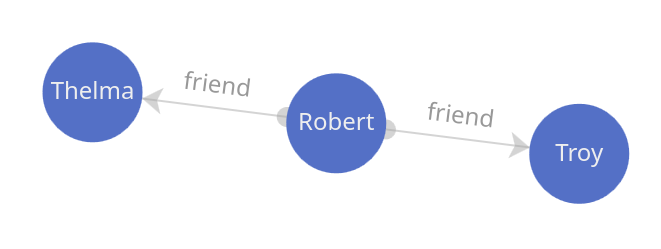
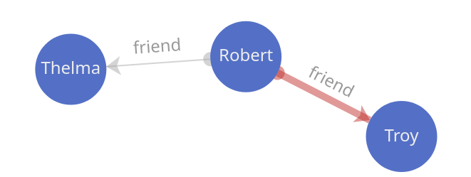
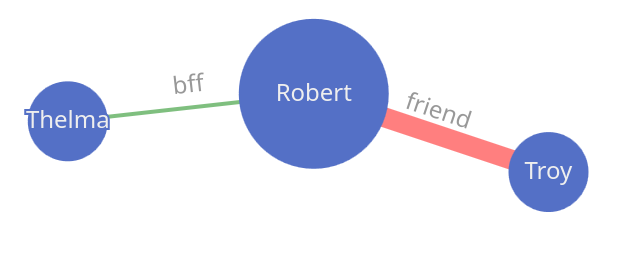

## Graphs

### Simple

{ width="50%" }

```groovy title="simple graph"
--8<-- "src/test/groovy/underdog/guide/plots/GraphSpec.groovy:simple"
```


### Directed graph

{ width="50%" }

```groovy title="directed graph"
--8<-- "src/test/groovy/underdog/guide/plots/GraphSpec.groovy:directed"
```

### Edge labels

{ width="50%" }

```groovy title="edge labels"
--8<-- "src/test/groovy/underdog/guide/plots/GraphSpec.groovy:show_labels"
```

### Showing paths

{ width="50%" }

```groovy title="show paths"
--8<-- "src/test/groovy/underdog/guide/plots/GraphSpec.groovy:graph_path"
```

### Graph domain

{ width="50%" }

```groovy title="domain classes"
--8<-- "src/test/groovy/underdog/guide/plots/GraphSpec.groovy:graph_domain"
```

### Customize

```groovy title="customization"
--8<-- "src/test/groovy/underdog/guide/plots/GraphSpec.groovy:customize"
```