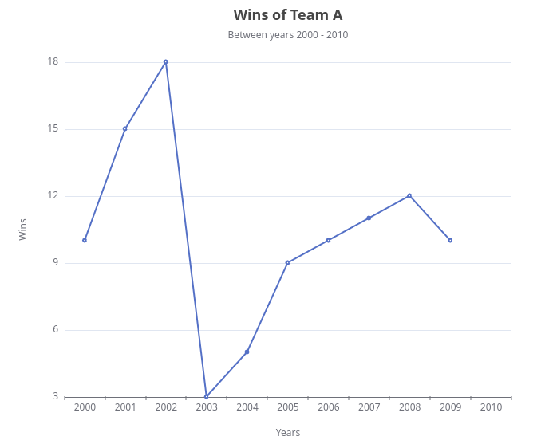
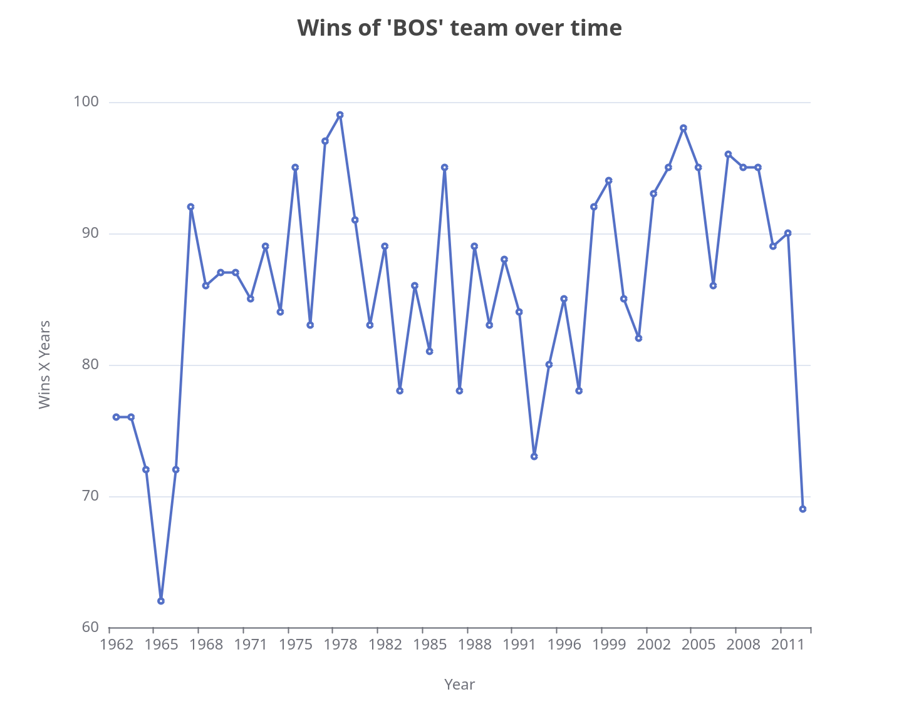
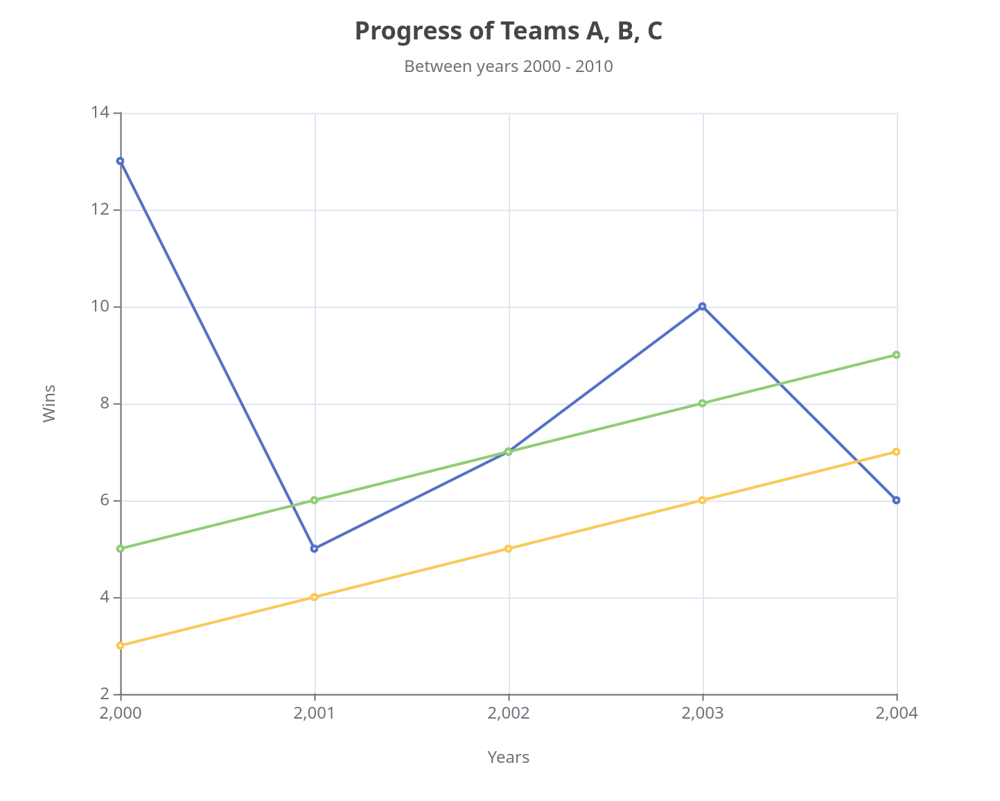

## Line

### Simple

Here is a simple line chart:

```groovy title="simple line"
--8<-- "src/test/groovy/underdog/guide/plots/LineSpec.groovy:simple"
```

{ width="60%" }

There are methods adapted for using Underdog's Series objects:

```groovy title="Series"
--8<-- "src/test/groovy/underdog/guide/plots/LineSpec.groovy:line_from_series"
```

{width="60%"}

In any method using Underdog's Series there is no attribute for changing the xLabel or the yLabel as it takes the Series' name. To change the label you can rename the Series' name as mentioned in the example.

### N-lines

```groovy title="lines using collections"
--8<-- "src/test/groovy/underdog/guide/plots/LineSpec.groovy:n_lines"
```

{ width="60%" }

### Customize

As in any chart once we've created our Options object and before calling `show()` we can use the `Options#customize()` method to customize the chart using Groovy's Echart DSL.

```groovy title="Customize"
--8<-- "src/test/groovy/underdog/guide/plots/LineSpec.groovy:customize"
```


In this occasion we are adding the chart legend and positioning it to the top-right side of the chart.

{ width="60%" }