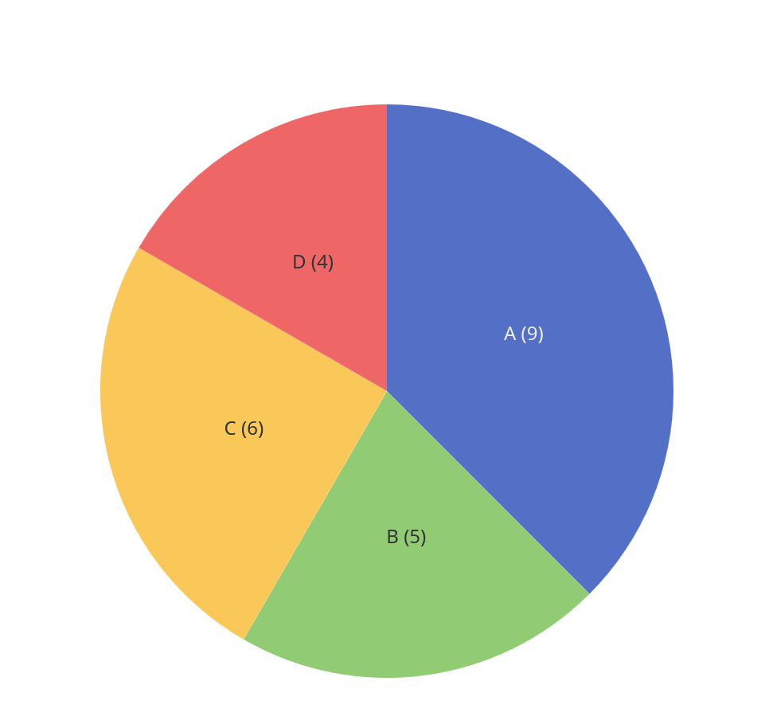
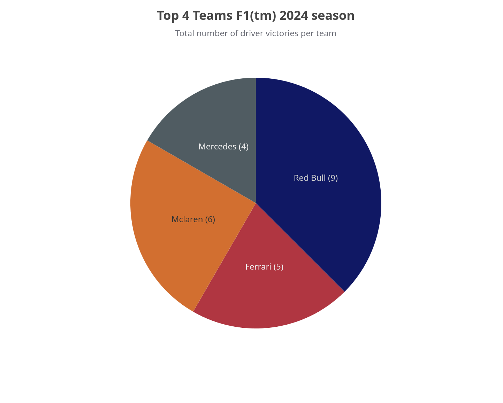
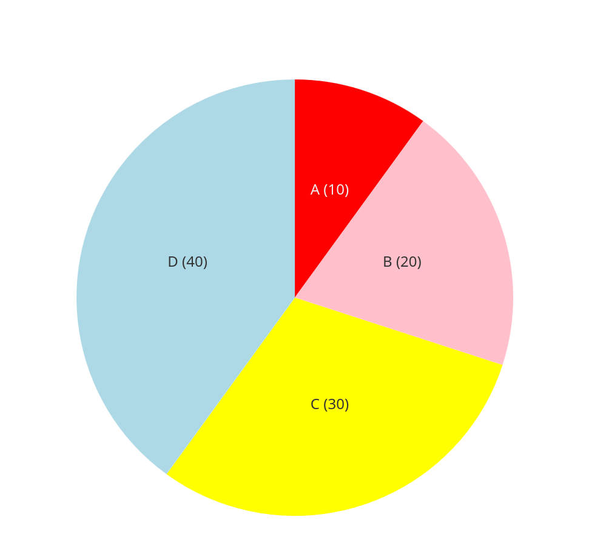
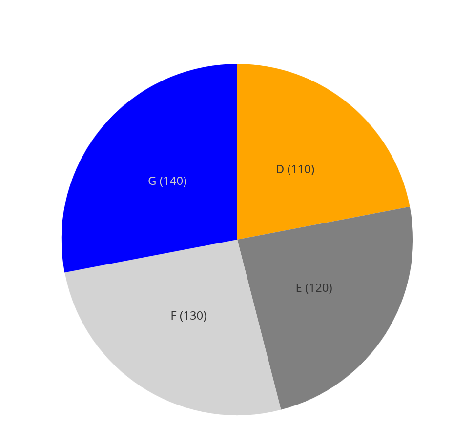

## Pie

!!! info "Wikipedia"

    According to [Wikipedia](https://en.wikipedia.org/wiki/Pie_chart) a pie chart (or a circle chart) is a circular statistical graphic which is divided into slices to illustrate numerical proportion.

In a pie chart, the arc length of each slice (and consequently its central angle and area) is proportional to the quantity it represents.

### Simple

```groovy title="building pie"
--8<-- "src/test/groovy/underdog/guide/plots/PieSpec.groovy:simple"
```

{ width="50%" }

### Color mapping

```groovy title="color mapping"
--8<-- "src/test/groovy/underdog/guide/plots/PieSpec.groovy:color_mapping"
```

{ width="50%" }

### Dataframe

```groovy title="dataframe"
--8<-- "src/test/groovy/underdog/guide/plots/PieSpec.groovy:dataframe"
```

{ width="50%" }

```groovy title="series"
--8<-- "src/test/groovy/underdog/guide/plots/PieSpec.groovy:series"
```

{ width="50%" }