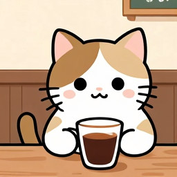
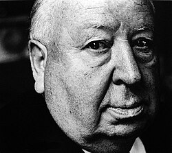
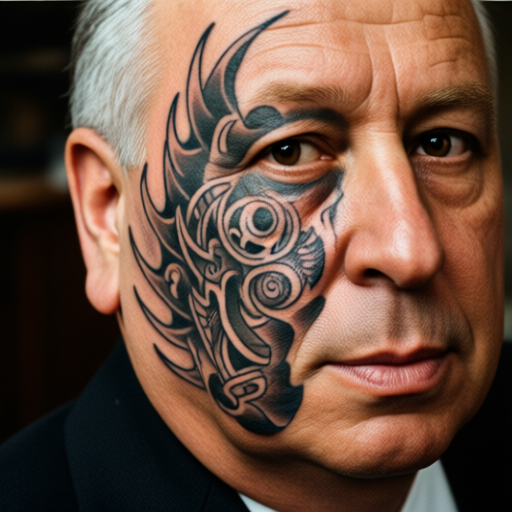
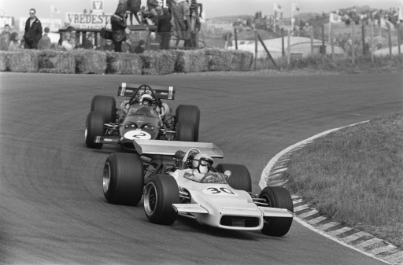
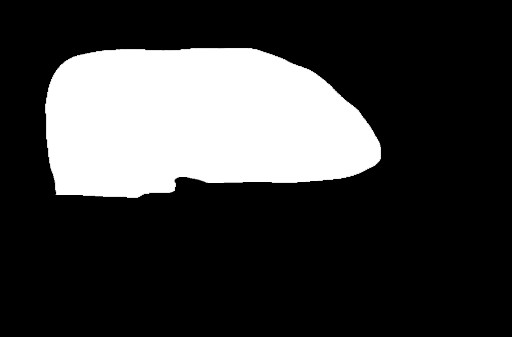
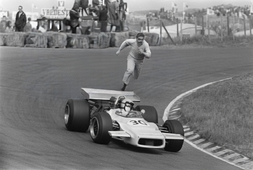

## openai

There are plenty of other OpenAI java clients. This one tries to be simple and small, so it's possible that could 
be some features missing. 

### Image generation

Image generation method corresponds to the 
OpenAI [Images generations](https://developers.openai.com/api/reference/resources/images) endpoint. 

```text title="OpenAI endpoint"
POST /images/generations
```

But first of all, lets generate an image:

```groovy title="getting started"
--8<-- "src/test/groovy/underdog/guide/sd/OpenAISpec.groovy:getting_started"
```

Here's the resulting image:

{ width="30%" }

### Image Editing

Image edits method corresponds to the
OpenAI [Create Image edit](https://developers.openai.com/api/reference/resources/images/methods/edit) endpoint.

```text title="OpenAI endpoint"
POST /images/edits
```

This endpoint takes a given photo we want to modify a prompt and optionally a mask image to change
the original image passed.

#### Prompt Only

We have a source image we want to edit. It's Alfred's Hitchcock 

{ width="30%" }

I'm editing the photograph, and I'm adding a tattoo to Hitchcock's face

```groovy title="Tattoed Hitchcock"
--8<-- "src/test/groovy/underdog/guide/sd/OpenAISpec.groovy:edit"
```

{ width="30%" }

#### Prompt & Mask

The Hitchcock example was great, but sometimes you just want to preserve the main
subject in an image and change only a certain area. For that always comes handy applying
a mask, and telling the model to fill the original image according to the mask provided.

Bottom line, we need:

- Original Image
- Mask Image
- Prompt to tell the model to fill whatever the mask represents

The following example uses an [old photograph from Wikipedia](https://upload.wikimedia.org/wikipedia/commons/6/63/Wedstrijdmoment%2C_Bestanddeelnr_923-4535.jpg)
of an historical race.

| Original                         | Mask                                  |
|----------------------------------|---------------------------------------|
|  |  |


I've created a mask which will indicate the model that the area of the card behind
should be fulfilled by the model with the information provided by the prompt.

- White area: area to fulfill by the model
- Black area: keep unchanged

```groovy title="OpenAI Generations (Mask)"
--8<-- "src/test/groovy/underdog/guide/sd/OpenAISpec.groovy:edit_mask"
```

And here's the result:

{ width="50%" }