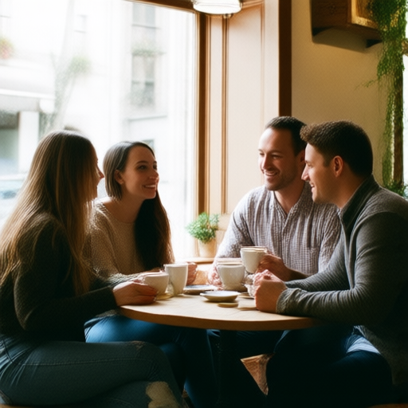
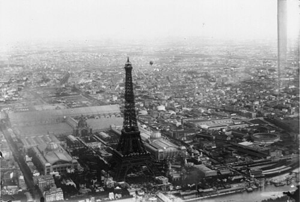
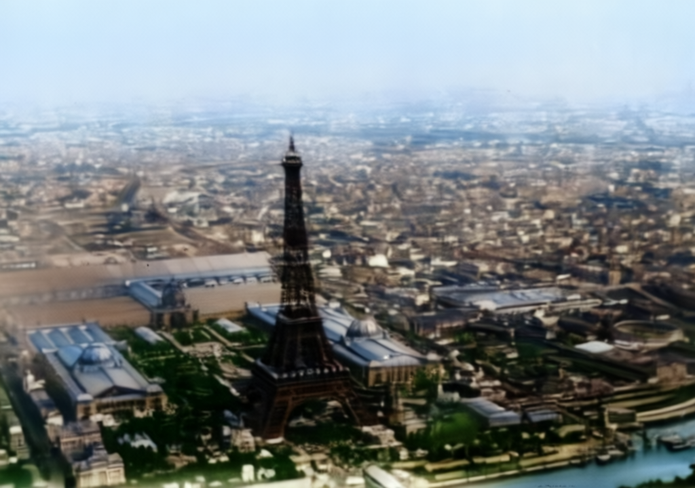
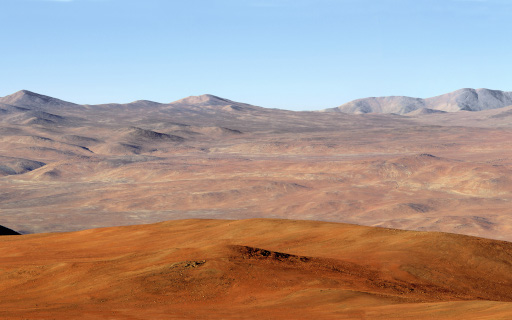
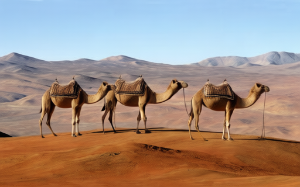

## sdapi

This client exists for compatibility with WebUI-style tools. Use it when you want to access 
txt2img / img2img-style endpoints.

### Image Generation

This method corresponds to a given WebUI like endpoint:

```text title="WebUI like endpoint"
POST /sdapi/v1/txt2img
```

The following example generates a group of friends having a coffee. Notice how, apart from using
a prompt to tell the model what to do, I'm also using a negative prompt
to tell the model what not to do.

```groovy title="txt2img"
--8<-- "src/test/groovy/underdog/guide/sd/SDApiSpec.groovy:txt2img"
```

- **prompt**: tells the model what to do
- **negativePrompt**: tells the model what to avoid
- **cfg_scale**: controls how strongly the model follows your prompt
- **steps**: the number of denoising iterations. How long must the model work in order to get a result.
- **seed**: The seed is the random number that initializes the image generation process. 

Normally the seed is used to be able to achieve same results with the same inputs: 
Same prompt + same model + same settings + same seed → nearly identical image

Here's the generated image:

{ width="30%" }

The full list of properties you can pass as an option are:

Currently supported request fields:

| Property                    | Description                                                                                                                                                                                                                                   |
|-----------------------------|-----------------------------------------------------------------------------------------------------------------------------------------------------------------------------------------------------------------------------------------------|
| `prompt(String)`            | Required, Tells model what to do                                                                                                                                                                                                              |
| `negative_prompt(String)`   | Optional, Tells model what to avoid                                                                                                                                                                                                           |
| `width(Integer)`            | Positive image width                                                                                                                                                                                                                          |
| `height(Integer)`           | Positive image height                                                                                                                                                                                                                         |
| `steps(Integer)`            | Sampling steps. How many iterations the model is allowed to do trying to converge to the result.                                                                                                                                              |
| `cfgScale(Integer)`         | Controls how strongly the model follows your prompt. (1-5) more creative, (6-9) best for photorealism, (10-20+) very strict, could overfit                                                                                                    |
| `seed(Integer)`             | `-1` means random, helps to create reproducible results with same config                                                                                                                                                                      |
| `batchSize(Integer)`        | Number of images                                                                                                                                                                                                                              |
| `clipSkip(Boolean)`         | Optional, controls how many layers at the end of the CLIP text encoder are skipped before passing the prompt embedding to the diffusion model. Higher (2) values improve anime/cartoon models, lower (1) tends to favor photorealistic images |
| `samplerName(String)`       | Sampler name. The sampler is the algorithm that gradually turns random noise into an image during the denoising process                                                                                                                       |
| `scheduler(String)`         | Scheduler name. The scheduler controls how the noise level changes across the denoising steps                                                                                                                                                 |
| `lora(List<Map>)`           | Structured LoRA (Low Rank) list                                                                                                                                                                                                               |
| `extraImages(List<String>)` | Base64 or data URL images                                                                                                                                                                                                                     |
| `enableHr(Boolean)`         | Enable highres fix for `txt2img`                                                                                                                                                                                                              |
| `hrUpscaler(String)`        | `Lanczos`, `Nearest`, a latent mode such as `Latent (nearest-exact)`, or an upscaler model name from `/sdapi/v1/upscalers`                                                                                                                    |
| `hrScale(Number)`           | Highres scale when resize target is not set                                                                                                                                                                                                   |
| `hrResizeX(Integer)`        | Highres target width, `0` to use scale                                                                                                                                                                                                        |
| `hrResizeX(Integer)`        | Highres target height, `0` to use scale                                                                                                                                                                                                       |
| `hrSteps(Integer)`          | Highres second-pass sample steps, `0` to reuse `steps`                                                                                                                                                                                        |
| `denoisingStrength(Number)` | Highres denoising strength for `txt2img`                                                                                                                                                                                                      |


### Image Upscaling

Sometimes you may have a given image and you just want to scale it up or down. To show
this functionality, we are using an old photograph with low resolution.

<figure markdown="span">
    { width="50%" }
    <figcaption>512x384</figcaption>
</figure>


Now we'd like to get the same image but double the size.

```groovy title="upscaling"
--8<-- "src/test/groovy/underdog/guide/sd/SDApiSpec.groovy:upscaling"
```

<figure markdown="span">
    { width="30%" }
    <figcaption>1024x720</figcaption>
</figure>

### Image Editing

#### Modifying

Although there is a specific method for editing, the image generation method `txt2img` can be also be used for 
modifying an image. The following image is taken from the wikipedia:

{ width="30%" }

```groovy title="modifying"
--8<-- "src/test/groovy/underdog/guide/sd/SDApiSpec.groovy:modifying"
```

{ width="30%" }

#### Masking

TOOD

#### Combination

Another use case is when you'd like to combine two or more images together. Next example mixes
a desert and a jet fighter together.

| Desert                       | Fighter Jet                                      |
|------------------------------|--------------------------------------------------|
|  | { width="60%" } |

```groovy title="combination"
--8<-- "src/test/groovy/underdog/guide/sd/SDApiSpec.groovy:combination"
```

The result is the following picture:

{ width="30%" }

### Meta Information

There is so much information that can help you to create incredible images and videos using
stable diffusion. This information is available in the sdapi through a series of endpoints.

```groovy title="meta"
--8<-- "src/test/groovy/underdog/guide/sd/SDApiSpec.groovy:meta"
```