## Components

This section lists all out-of-the-box components you can use in your Spectacle applications. 

### Common properties 

In general all components inherit from **HtmlElement** therefore have the following properties:

- **id**: used by the application for replacing the html whenever the output fields are updated
- **name**: used by the application to get data from input fields and send data to output fields
- **application**: has access to almost every aspect to the application: elements, events, configuration...
- **className**: HTML class attribute. Can be used to customize the appearance of the element
- **parent**: give access to the immediate parent container

### Bootstrap and CSS

All components and containers are based on [Bootstrap](https://getbootstrap.com) and more specifically in the  [Tabler](https://github.com/tabler/tabler) project. Check out these project's guidelines whenever you'd like to customize existent or new custom components.

All components have the property **className** which can be used to customize how the component is shown. The
**className** property also follows special rules, for example:

```groovy title="replace"
button(className: "btn btn-warning")
```

This will replace any styles applied previously to the button component. However this:

```groovy title="append"
button(className: "+btn-warning")
```

Notice the **+** symbol at the beginning. This means that the classes provided by the className attribute will be
appended to those already set by default by the component.

### Events

TODO

### HtmlDiv

```groovy title="div"
div(className: '...') {
    // nested elements
}
```

### HtmlColumn

```groovy title="column"
col(className: '...') {
    // nested elements
}
```

### HtmlRow

```groovy title="row"
row(className: '...') {
    // nested elements
}
```

### HtmlForm

```groovy title="form"
form {
    // nested elements    
}
```

### HtmlButton

Represents a HTML button

```groovy title="HtmlButton"
--8<-- "src/test/groovy/underdog/guide/spectacle/ComponentsSpec.groovy:button"
```

Image

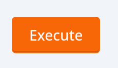{ width="10%" }

### HtmlInputText

Represents a HTML input of type text

```groovy title="HtmlInputText"
--8<-- "src/test/groovy/underdog/guide/spectacle/ComponentsSpec.groovy:text"
```

Image

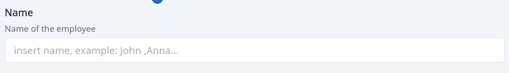{ width="80%" }

### HtmlInputNumber

Represents a HTML input of type number

```groovy title="HtmlInputNumber"
--8<-- "src/test/groovy/underdog/guide/spectacle/ComponentsSpec.groovy:number"
```

Image

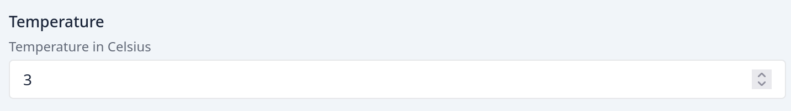{ width="80%" }

### HtmlCard

Represents a Bootstrap card. A card has normally three parts:

- card header
- card body
- card footer

```groovy title="HtmlCard"
--8<-- "src/test/groovy/underdog/guide/spectacle/ComponentsSpec.groovy:card"
```

Image

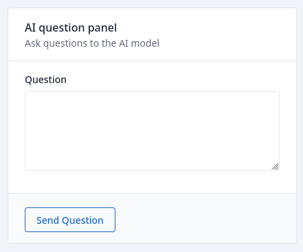{ width="40%" }

### HtmlChart

Renders an Underdog's plot. It receives as input value any `underdog.plots.Options` instance. You can provide the plot as the **defaultValue** or using the closure as a factory.

```groovy title="HtmlChart"
--8<-- "src/test/groovy/underdog/guide/spectacle/ComponentsSpec.groovy:chart"
```

Image

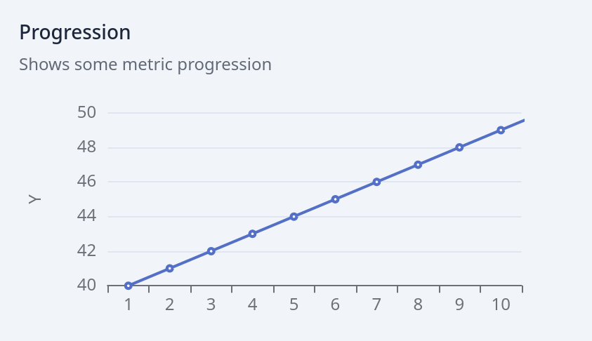{ width="50%" }

### HtmlDataFrame

Represents an Underdog's dataframe

```groovy title="HtmlDataFrame"
--8<-- "src/test/groovy/underdog/guide/spectacle/ComponentsSpec.groovy:dataframe"
```

Image

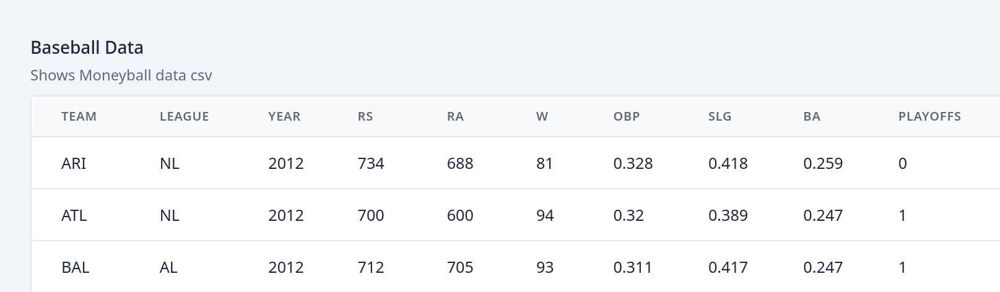{ width="80%" }

### HtmlMarkdown

Represents a markDown text block. Very useful when documenting certain part of the demos.

```groovy title="HtmlMarkdown"
--8<-- "src/test/groovy/underdog/guide/spectacle/ComponentsSpec.groovy:markdown"
```

Image

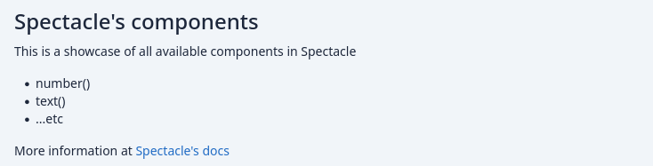{ width="60%" }

### HtmlNumberCard

Represents a Bootstrap card showing just a number

```groovy title="HtmlNumberCard"
--8<-- "src/test/groovy/underdog/guide/spectacle/ComponentsSpec.groovy:numberCard"
```

Image

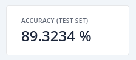{ width="25%" }

### HtmlOptionGroup

Represents an HTML option group input field

```groovy title="HtmlOptionGroup"
--8<-- "src/test/groovy/underdog/guide/spectacle/ComponentsSpec.groovy:optionGroup"
```

Image

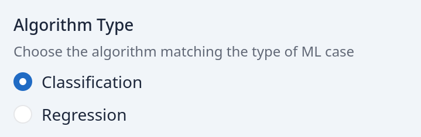{ width="40%" }

### HtmlCheckboxGroup

Represents an HTML checkbox group input field

```groovy title="HtmlCheckboxGroup"
--8<-- "src/test/groovy/underdog/guide/spectacle/ComponentsSpec.groovy:checkboxGroup"
```

Image

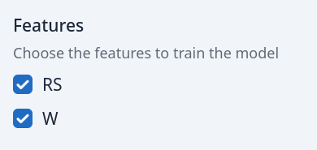{ width="30%" }

### HtmlRange

Represents an HTML slider input field

```groovy title="HtmlRange"
--8<-- "src/test/groovy/underdog/guide/spectacle/ComponentsSpec.groovy:range"
```

Image

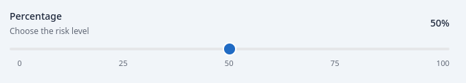{ width="60%" }

### HtmlResetLink

Inside a form, represents a reset button, with the appearance of a link

```groovy title="HtmlResetLink"
--8<-- "src/test/groovy/underdog/guide/spectacle/ComponentsSpec.groovy:resetLink"
```

Image

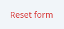{ width="10%" }

### HtmlSelect

Represents an HTML select input field. It can contain as many **option(Object, Object)** options as you like.

```groovy title="HtmlSelect"
--8<-- "src/test/groovy/underdog/guide/spectacle/ComponentsSpec.groovy:select"
```

Image

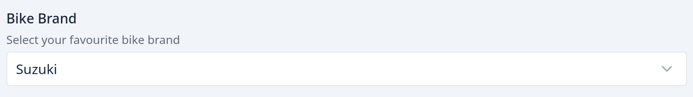{ width="80%" }

### HtmlTextArea

Represents an HTML text area field

```groovy title="HtmlTextArea"
--8<-- "src/test/groovy/underdog/guide/spectacle/ComponentsSpec.groovy:textArea"
```

Image

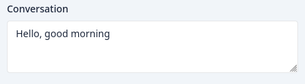{ width="50%" }

### HtmlDatePicker

Renders a date input field


```groovy title="HtmlDatePicker"
--8<-- "src/test/groovy/underdog/guide/spectacle/ComponentsSpec.groovy:datePicker"
```

Image

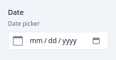{ width="25%" }

### HtmlTimePicker

Renders a time input field

```groovy title="HtmlTimePicker"
--8<-- "src/test/groovy/underdog/guide/spectacle/ComponentsSpec.groovy:timePicker"
```

Image

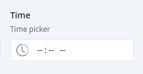{ width="25%" }

### HtmlSwitchGroup

Renders a checkbox group with the appearance of switches:

```groovy title="HtmlSwitchGroup"
--8<-- "src/test/groovy/underdog/guide/spectacle/ComponentsSpec.groovy:checkboxSwitchesGroup"
```

Image

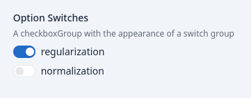{ width="30%" }

### HtmlAccordion

Renders an accordion component. Useful for grouping components:

```groovy title="HtmlAccordion"
--8<-- "src/test/groovy/underdog/guide/spectacle/ComponentsSpec.groovy:accordion"
```

Image

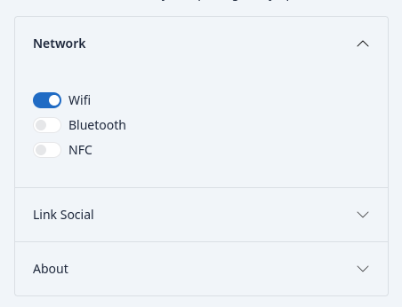{ width="30%" }