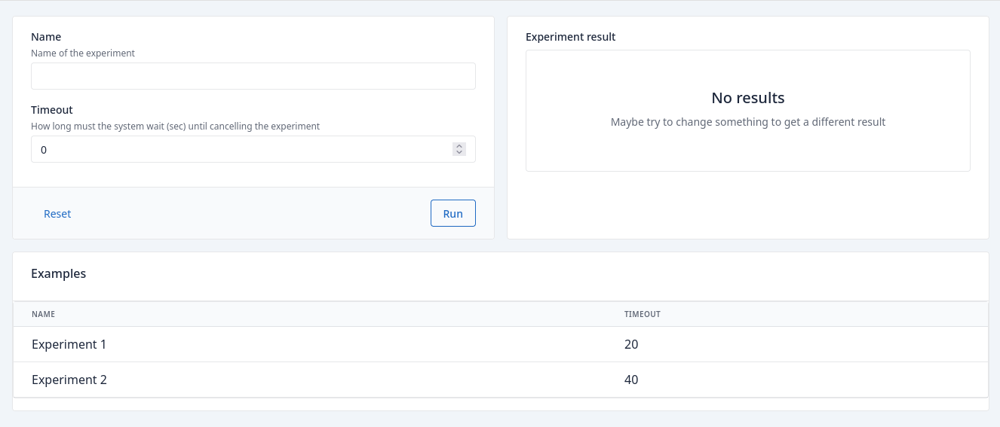

## Spec

Spec is a convention on how to arrange inputs, outputs and examples to build forms without having to coup too much
with complexity. Basically a spec block contains three sub-blocks:

```groovy title="spec block"
page(...){
    spec {
        inputs {
            
        }
        outputs {
            
        }
        examples = []
    }    
}
```

- **inputs**: all input elements gathering data from user
- **outputs**: all elements showing results from processing input data
- **examples**: a list of examples on input values that can be used to fill in input fields.

Here you have an example:

```groovy title="spec example"
--8<-- "src/test/groovy/underdog/guide/spectacle/SpecSpec.groovy:example"
```

If we execute this application, by default it will render inputs to the left, outputs to the right and examples below.

<figure markdown="span">
{ width="100%" }
</figure>

The Spec represents a form and it will send the data from the input types to the server, then process the data and send
back the data to be rendered by the output fields. But... Where is the data processing ?

In order to tell the spec how to process the data, we need to create the **onSubmit** method, which later on will be
executed in the server:

```groovy title="spec example complete"
--8<-- "src/test/groovy/underdog/guide/spectacle/SpecSpec.groovy:example_complete"
```

Here the **onSubmit** method:

- **Retrieves data** from inputs and parse them to proper types

```groovy
def timeout = context.pInteger(field.timeout)
def name = context.param(field.name)
```

In order to point to the right fields we need to make use of the _field.NAME_OF_THE_FIELD_ notation, and use this
notation to both in the _input field declaration_ and the _onBody parameter retrieval_.

- **Uses the data** to log something on the server side

```groovy
println("experiment ${name} must not last more than ${timeout} seconds")
```

- **Returns data** that will be rendered by the output fields

```groovy
return Underdog.df().empty(name)
```

This time we return an empty dataframe so no results will be shown in the UI but you can check the application will
render the console output:

```shell
experiment My Experiment must not last more than 23 seconds
```
