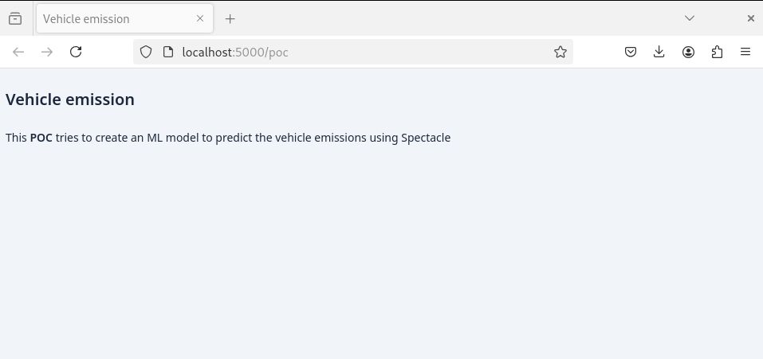
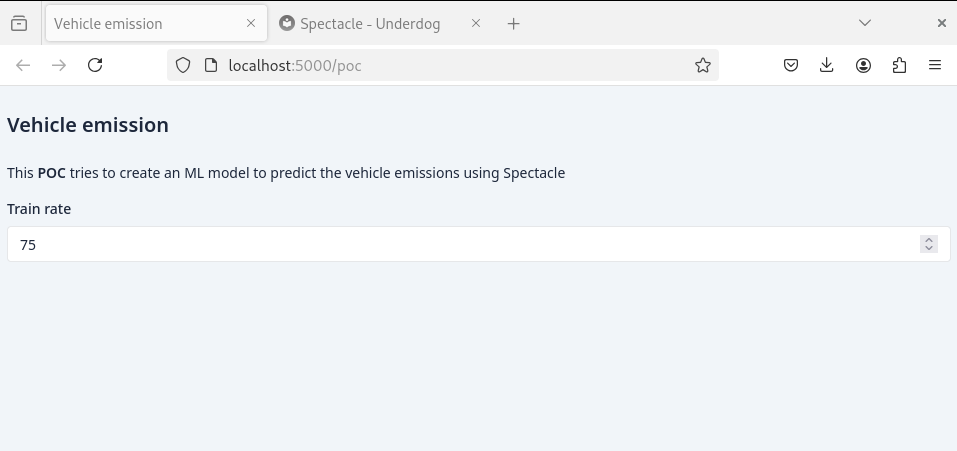
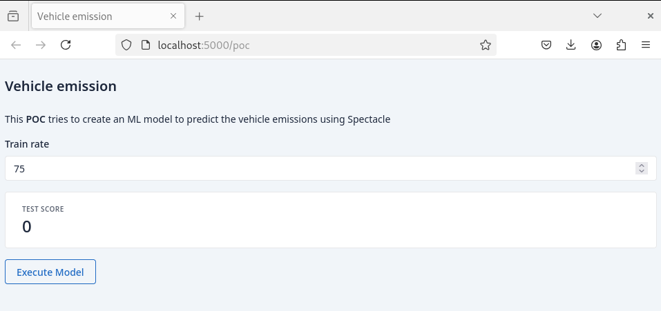

## Tutorial

### Introduction

As a proof of concept I want to show how the amount of training data impacts on the scoring of the model against the testing data.

In ML when using a model, first thing we do is to train the model with some training data. That training data should
be different from the testing data to avoid the model to learn all possible cases and therefore over-fitting the model.

As a naive approach **I'd like to create a simple UI where I can chose how much training data is used to train the model**
before training the model and get the accuracy score of the model against the remaining test data.

Basically this experiment needs:

- Some **basic information** about the experiment
- A **number input field** to choose between 25 and 75 the percentage of training data
- A **card showing the score** of the model against the remaining data
- **A button** to trigger the experiment

### Dependencies

The module required to follow this tutorial is the `spectacle` module:

=== "Gradle"
    ```groovy
    implementation 'com.github.grooviter:underdog-spectacle:VERSION'
    ```
=== "Maven"
    ```xml
    <!-- machine learning -->
    <dependency>
        <groupId>com.github.grooviter</groupId>
        <artifactId>underdog-spectacle</artifactId>
        <version>VERSION</version>
    </dependency>
    ```
=== "Grapes"
    ```groovy
    @Grab('com.github.grooviter:underdog-spectacle:VERSION')
    ```

### Data

I'm using the dataset mentioned in [this Kaggle entry](https://www.kaggle.com/discussions/accomplishments/486978)

### Basic information

First of all I'm building a simple UI with a title and a description of what I'd like to achieve.

```groovy title=""
--8<-- "src/test/groovy/underdog/guide/spectacle/TutorialSpec.groovy:title_and_description"
```

In order to launch the app you can add the launch call:

```groovy title="launch"
--8<-- "src/test/groovy/underdog/guide/spectacle/TutorialSpec.groovy:launch"
```

That will start the Spectacle service at [http://localhost:5000/poc](http://localhost:5000/poc) showing the following web page:

<figure markdown="span">
{ width="100%" }
</figure>

### Adding components

I'm planning to split the train and test dataset but at the moment I'm not sure on how much this split is gonna be, so
It would be nice to have a way of changing that rate dynamically so I'm adding a new element to control that.

```groovy title="train and test split control"
--8<-- "src/test/groovy/underdog/guide/spectacle/TutorialSpec.groovy:train_and_test_split"
```

<figure markdown="span">
{ width="100%" }
</figure>

Once I'm done with the split I'd like to trigger the regression and get back the result of applying the model to
the test set. So for the moment I'm adding:

- a button to trigger the regression
- a card showing the result
- the action handler which will receive the train/test rate and will return the result

```groovy title="basic interaction"
--8<-- "src/test/groovy/underdog/guide/spectacle/TutorialSpec.groovy:interaction"
```

The button's `onClick` method receives the following arguments:

- **inputs**: a list of the names of the input controls we are taking the parameters from
- **outputs**: a list of the names of the target controls where the method's result is sent
- **function**: a closure receiving data from inputs and producing data for outputs

The data return by the function will be rendered by the output targets. In this case the data will be rendered using
a number card element which knows how to render the random number generated by the `onClick` callback function.

<figure markdown="span">
{ width="100%" }
</figure>

### Component names

All controls must have names because otherwise Spectacle wouldn't be able to know where to get the data from or where
to send the data to. Check how the previous example could be simplified:

```groovy title="basic interaction (simplified)"
--8<-- "src/test/groovy/underdog/guide/spectacle/TutorialSpec.groovy:interaction_simplified"
```

Notice how we are using the reference of the elements (rate, card) to get the name and pass it to the `onClick`. 

That will work
perfectly because:

- If no names are passed to elements it will be **generated** at runtime
- All elements and interaction methods lives **under the same semantic scope**, which keeping long story
short means, that all methods and variables can see each other and get their names.

But once you start getting more complex page structures that will no longer could be the case. That's why we use the **field.nameOfTheComponent** functionality. The **field** variable can be accessed anywhere from the DSL of a
Spectacle application and basically works which two basic principles:

- **First time** field.X is triggered **a new generated name** will be stored under the X key
- **After that any call** to field.X **will return ALWAYS the same** value generated in the first place

Here's a scenario where the input control and interaction control are in different semantic scopes:

```groovy title="field.X functionality"
// 1) generating and setting a random name for the number
row {
    number(name: field.age)    
}

// 2) because field.age is already generated Spectacle reuse it
row {
    button(text: "Update Field") {
        onClick([], [field.age]) { req, res ->
            return new Random().nextDouble()
        }
    }   
}
```

### Executing ML

Ok we've got a basic UI to train a model with the training dataset rate chosen. The only thing remaining is to replace
the dummy code inside the **onCLick** function with the real code:

```groovy title="complete"
--8<-- "src/test/groovy/underdog/guide/spectacle/TutorialSpec.groovy:complete"
```

Now everytime we click on the button we will be triggering a real regression model training and then getting the
model score against the test dataset depending on the training rate we chose.